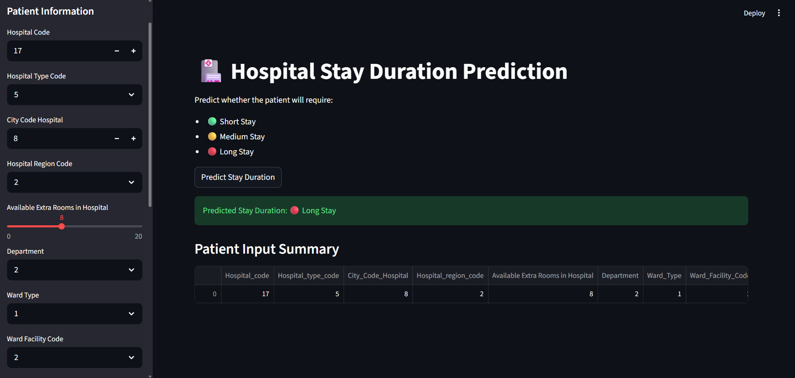
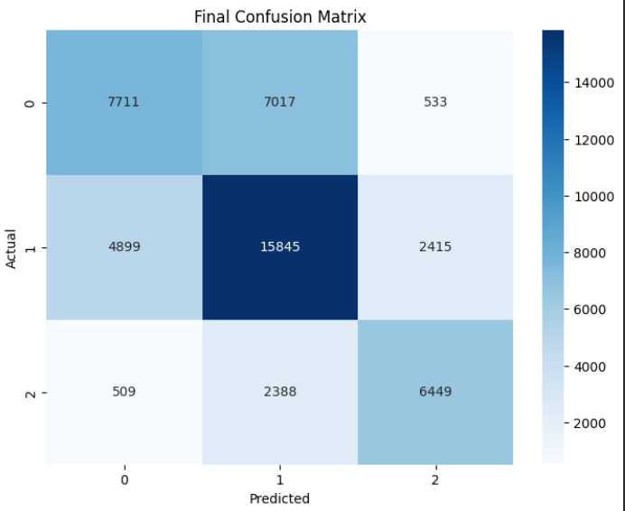
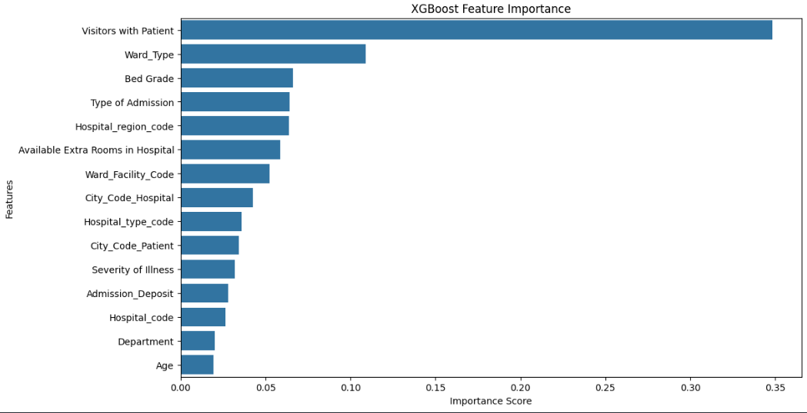

# 🏥 Hospital Stay Duration Prediction

A machine learning project that predicts grouped hospital stay duration categories using healthcare and patient-related information.

---

# 📌 Project Overview

This project aims to predict whether a patient will require:

- 🟢 Short Stay
- 🟡 Medium Stay
- 🔴 Long Stay

The project uses structured healthcare data and applies preprocessing, feature engineering, imbalance handling, and machine learning techniques to build an accurate prediction system.

---

# 🚀 Final Model Performance

## ✅ Tuned XGBoost Classifier

| Metric            | Score  |
| ----------------- | ------ |
| Accuracy          | 62.82% |
| Macro F1-Score    | 0.63   |
| Weighted F1-Score | 0.63   |

---

# 🧠 Machine Learning Pipeline

- Data Cleaning
- Missing Value Handling
- Ordinal & Label Encoding
- Exploratory Data Analysis (EDA)
- SMOTE for Class Balancing
- Feature Engineering
- Hyperparameter Tuning
- Class Grouping Strategy
- XGBoost Training

---

# 📊 Models Tested

- Random Forest
- XGBoost
- CatBoost
- Deep Neural Network (DNN)

---

# 🔥 Key Insight

The original dataset contained 11 highly overlapping target classes.

To improve prediction quality, hospital stay durations were grouped into:

- Short Stay
- Medium Stay
- Long Stay

This significantly improved model performance and reduced class confusion.

---

# 🖥️ Streamlit Web Application

The project includes an interactive Streamlit web application for real-time prediction.

## Run Locally

```bash
streamlit run app.py
```

---

# 📷 Screenshots

## Streamlit UI



## Confusion Matrix



## Feature Importance



---

# 🛠️ Technologies Used

- Python
- Pandas
- NumPy
- Scikit-learn
- XGBoost
- CatBoost
- TensorFlow / Keras
- Streamlit
- Matplotlib
- Seaborn

---

# 📂 Project Structure

```plaintext
Hospital-Stay-Duration-Prediction/
│
├── dataset/
├── screenshots/
│
├── app.py
├── hospital_stay_model.pkl
├── Hospital_Stay_Prediction.ipynb
├── requirements.txt
├── README.md
├── .gitignore

```

---

# 👨‍💻 Author

Moataz Nageh
